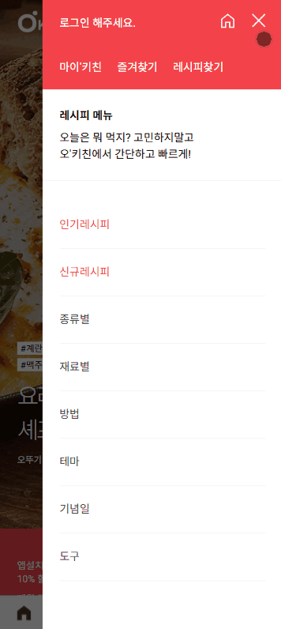
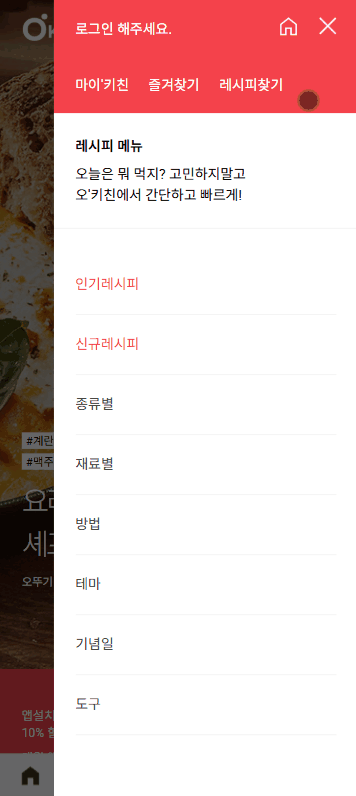
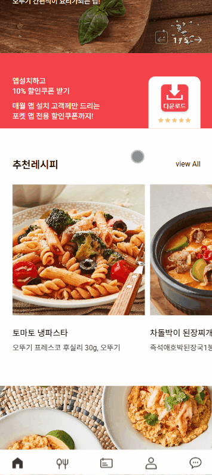
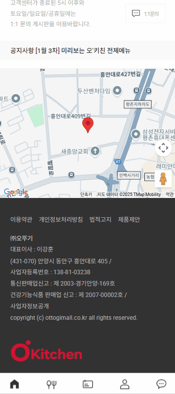
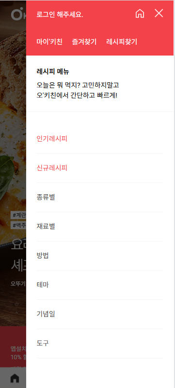

# O'Kitchen ( PWA )

</br>
</br>

### 🔍 주요특징
1. PWA (Progressive Web App)
* 서비스 워커를 등록하여 오프라인에서도 접근 가능.
* 사용자에게 앱 설치 시 할인 쿠폰 제공, 더 나은 사용자 경험을 위한 푸시 알림 기능 지원.
* 빠른 로딩 속도와 안정성을 통해 네이티브 앱과 유사한 경험 제공.

2. 모바일 메뉴
* 탭 클릭 시 모바일 메뉴와 배경 dim 효과 활성화.
* dim 영역 또는 닫기 버튼 클릭 시 모바일 메뉴 비활성화.

3. 슬라이더 기능
* 메인 슬라이더: 이전 및 다음 네비게이션 버튼과 분수 형태의 페이지네이션 제공.
* 서브 슬라이더: 반응형 디자인으로 다양한 화면 크기에 맞춰 슬라이드 수 조정.

4. 지도
* Google Maps API를 사용하여 지정된 위도 및 경도에 마커를 추가.
* 지도 제어 요소를 비활성화하여 사용자 경험 최적화.

</br>

### 🛠️ 사용 기술


      

</br>

### ⚙️ 기능 상세 설명

### ☂ 1. 모바일 메뉴 열기
기능
-
탭 버튼 클릭 시 모바일 메뉴를 열고 배경 dim 효과를 활성화합니다.

작동 방식
-
e.preventDefault(): 기본 클릭 동작을 방지합니다. <br>
document.body.classList.add("fixed"): 페이지 스크롤을 고정합니다. <br>
mobile.classList.add("active"): 모바일 메뉴를 표시합니다. <br>
dim.classList.add("active"): dim 효과를 적용합니다.


 ``` JavaScript
tab.addEventListener("click", function(e) {
    e.preventDefault();

    document.body.classList.add("fixed");
    mobile.classList.add("active");
    dim.classList.add("active");
});
```

---

</br>

### ☂ 2. 모바일 메뉴 닫기
기능
-
dim 영역 클릭 시 모바일 메뉴를 닫습니다.

작동 방식
-
document.body.classList.remove("fixed"): 페이지 스크롤을 다시 활성화합니다. <br>
mobile.classList.remove("active"): 모바일 메뉴를 숨깁니다. <br>
dim.classList.remove("active"): dim 효과를 제거합니다. <br>



 ``` JavaScript
dim.addEventListener("click", function() {
    document.body.classList.remove("fixed");
    mobile.classList.remove("active");
    dim.classList.remove("active");
});
```

---

</br>

### ☂ 3. 닫기 버튼 클릭 시 메뉴 닫기
기능
-
닫기 버튼 클릭 시 모바일 메뉴를 닫습니다.

작동 방식
-
위와 동일하게 메뉴와 dim 효과를 비활성화합니다.



 ``` JavaScript
closeBtn.addEventListener("click", function(e) {
    e.preventDefault();

    document.body.classList.remove("fixed");
    mobile.classList.remove("active");
    dim.classList.remove("active");
});
```

---

</br>

</br>

### ☂ 4. 메인 슬라이더 초기화
기능
-
메인 슬라이더를 초기화하여 이미지 슬라이드를 제공합니다.

설정
-
navigation: 이전 및 다음 버튼 설정. <br>
pagination: 분수 형태의 페이지네이션 설정. <br>


 ``` JavaScript
const mainSwiper = new Swiper("#main_slider .swiper-container", {
    navigation: {
        prevEl: "#main_slider .swiper-button-prev",
        nextEl: "#main_slider .swiper-button-next"
    },
    pagination: {
        el: "#main_slider .swiper-pagination",
        type: "fraction"
    }
});
```

---

</br>

### ☂ 5. 서브 슬라이더 초기화
기능
-
서브 슬라이더를 초기화하여 다양한 레시피를 표시합니다.

설정
-
slidesPerView: 기본적으로 1.5개 슬라이드 표시. <br>
spaceBetween: 슬라이드 간의 간격 설정. <br>
breakpoints: 화면 크기에 따라 슬라이드 수 조정. <br>



 ``` JavaScript
const subSwiper = new Swiper("#sub_slider .swiper-container", {
    slidesPerView: 1.5,
    spaceBetween: 10,
    breakpoints: {
        640: {
            slidesPerView: 3.5,
            spaceBetween: 5
        }
    }
});
```

---

</br>

### ☂ 6. 지도 초기화
기능
-
Google Maps API를 사용하여 특정 위치를 표시하는 지도를 초기화합니다.

설정
-
myLatLng: 마커가 표시될 위치의 위도 및 경도. <br>
new google.maps.Map(...): 지도 객체를 생성하고 설정합니다. <br>
google.maps.Marker(...): 마커를 추가하여 회사 위치를 표시합니다. <br>



 ``` JavaScript
let map;

function initMap() {
    let myLatLng = {lat: 37.390141551118695, lng: 126.97151846772532};

    let map = new google.maps.Map(document.getElementById("map"), {
        center: myLatLng,
        zoom: 16,
        mapTypeControl: false,
        zoomControl: false,
        fullscreenControl: false,
        rotateControl: false
    });

    let marker = new google.maps.Marker({
        position: myLatLng,
        map: map,
        title: "(주)오뚜기"
    });
}
```

---

</br>

### 📱 모바일 반응형 이미지

| 모바일 메인페이지 | 모바일 메뉴 | 모바일 컨텐츠 |
|------------------|------------|-------------|
|  |  |  |

</br>

### 🧾 View
https://neos-od.github.io/O-Kitchen/
